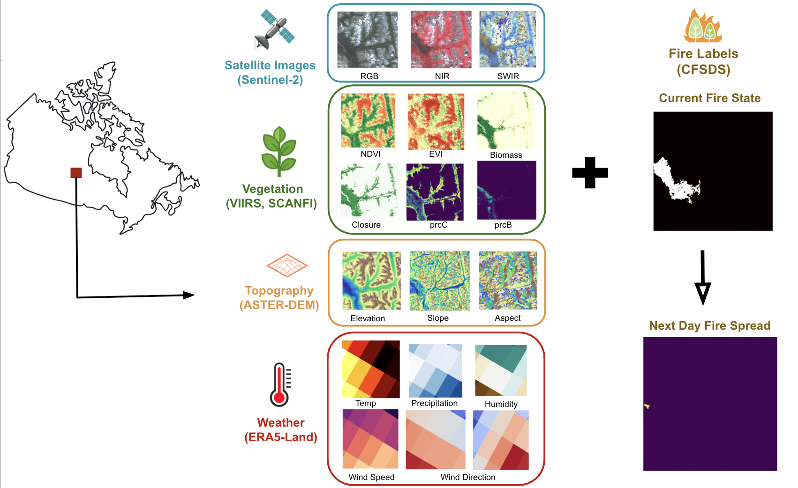

# CanadaWildfireDaily: A Large-Scale Dataset for Daily Wildfire Spread in Canada
[Currently under review]

This repository contains the code base for the dataset and the benchmark, CanadaWildFireDaily, a dataset for daily wildfire spread prediction.


---

## 🛠️ Part 1 : Path Configuration (settings.py)
Before running any scripts, open configs/settings.py. This file acts as the central nervous system for the pipeline. You must update the following three variables with their **absolute** paths on your machine:

* `PROJECT_FOLDER`: The absolute path to the root repository folder that contains all of the code (e.g., the src, configs, and data_preparation directories).
* `DATA_FOLDER`: The absolute path to the directory containing the raw downloaded datasets, structured exactly as shown in Section 1.2 above.
* `OUTPUT_FOLDER`: The absolute path to the directory where all generated data will be saved. This is where the scripts will output the final .h5 PyTorch datasets.

** Note on Folder Creation:** You only need to manually set up the directories containing the downloaded raw data (like `ERA5/`, `SCANFI/`, etc.). As soon as you run any script in this project, `settings.py` will automatically create the entire required `OUTPUT_FOLDER` structure (including the DEM, Satellite Status, and Metadata directories) if they do not already exist.

---

## ⚙️ Part 2: Environment Setup

### 2.1 Virtual Environment
Create and activate a fresh Python virtual environment:
```bash
# Create the environment
python -m venv env_wildfires_spread

# Activate (Linux/Mac)
source env_wildfires_spread/bin/activate

# Activate (Windows)
env_wildfires_spread\Scripts\activate
```

### 2.2 Install Python Dependencies
Install the required packages:
```bash
pip install -r requirements.txt
```

## 📂 Part 3: Samples Generation

This is the final data preparation step before model training. At this stage, you have two options: you can either use our pre-compiled samples directly, or you can run this script to generate them from scratch using the raw data.

### Option 1: Use Pre-compiled Samples (Recommended)
If you want to skip the data generation process and jump straight to training, you can use our finalized samples.
Samples can be downloaded from [here](https://huggingface.co/datasets/CanadaWildFireDaily/CanadaWildFireDaily-v1/tree/main/data_samples)
Place them inside the `SAMPLES` folder defined in your `settings.py`, following this exact structure:
```text
SAMPLES/
   ├── train/
   ├── val/
   └── test/
```

### Option 2: Generate Samples from Scratch
If you prefer to run the sample generation process yourself, this script will read the raw daily `.h5` files and the JSON tile mappers to compile the finalized samples. 

> ⚠️ **Important Data Requirements:** > To run this process, you must have the `.h5` files, the JSON mappers (fires metadata), and the raw Fire Growth CSV files. All of these raw data files are provided in our Hugging Face repository in the `raw_data` folder: [CanadaWildFireDaily-v1](https://huggingface.co/datasets/CanadaWildFireDaily/CanadaWildFireDaily-v1).

Make sure to organize the downloaded files according to the directories defined in your `settings.py`:

**1. Fire Growth CSVs:** Place these in your `BASE_FOLDER`. The structure must look exactly like this:
```text
└── BASE_FOLDER/
    ├── Firegrowth_pts_v1_1_2024/Firegrowth_pts_v1_1_2024.csv
    ├── Firegrowth_pts_v1_1_2023/Firegrowth_pts_v1_1_2023.csv
    ├── Firegrowth_pts_v1_1_2022/Firegrowth_pts_v1_1_2022.csv
    ├── Firegrowth_pts_v1_1_2021/Firegrowth_pts_v1_1_2021.csv
    └── Firegrowth_pts_v1_1_2020/Firegrowth_pts_v1_1_2020.csv
```

**2. JSON Mappers:** Place these in your `METADATA_FOLDER`.
```text
└── METADATA_FOLDER/
    ├── tile_dob_mapper_2024.json
    ├── tile_dob_mapper_2023.json
    ├── tile_dob_mapper_2022.json
    ├── tile_dob_mapper_2021.json
    └── tile_dob_mapper_2020.json
```

**3. H5 Files:** Place these in your `H5_OUTPUT_FOLDER`.

This step handles the **Train/Validation/Test splitting** using the CSV fire growth data. It uses the tile mappers to guarantee that geographically overlapping fires are kept strictly within the same fold, ensuring zero spatial data leakage between your training and testing sets.

To generate the dataset, run the following command from the root of your project:

```bash
cd /path/to/your/PROJECT_FOLDER/

python -m samples_generation.data_generator_main --config configs/default.yaml --type simple
```

### Script Arguments:
* `--config`: The path to your configuration file (e.g., `configs/default.yaml`).
* `--type`: The formatting style of the generated samples. 
  * `choices=["simple", "timeseries"]`
  * **`simple`**: Generates standard single-step spatial inputs (Day $T \rightarrow$ Predict Day $T+1$). Best for standard U-Net architectures.
  * **`timeseries`**: Generates sequential temporal inputs (e.g., Days $T, T+1, T+2 \rightarrow$ Predict Day $T+3$). Best for spatio-temporal architectures like ConvLSTM.

**Key Execution Notes:**
* **Dataset Normalization:** During generation, the script automatically calculates the global mean and standard deviation for all features across the training split and saves a `.json` file. This ensures the validation and test sets are normalized exclusively using training statistics.
* **Output Location:** The script saves each generated sample as an individual PyTorch (`.pt`) file inside designated split subfolders (e.g., `train`, `val`, `test`) within either your `SAMPLE_FOLDER` or `TIMESERIES_SAMPLE_FOLDER`. Each file contains a dictionary with the following:
  * `x`: The input features.
  * `y`: The ground truth target mask.
  * `delta_t`: The satellite image age in days (included for `simple` samples only).
  * `positions`: The sequence positions (included for `timeseries` samples only).
* **Optimization Note:** It is possible to build a PyTorch Dataset that reads directly from the raw daily `.h5` files during training using the code provided in `samples_generation/data_generator.py` and `samples_generation/data_generator_timeseries.py`. However, we pre-compute and save these ready-to-batch `.npz` arrays purely for optimization purposes to significantly accelerate the training loop and maximize GPU utilization.

## 🤖 Part 4: Modeling

With the samples available, the model is ready to train.

### 4.1 Configuration (`configs/default.yaml`)
All training hyperparameters, hardware settings, and logging preferences are centralized in `configs/default.yaml`. Before training, you can adjust this file to suit your needs.

### 4.2 Model Selection & Customization
Multiple model architectures are implemented in the `src/models/` directory to handle different temporal and spatial requirements. 

To switch between architectures (which will automatically configure the corresponding dataloaders, such as swapping from single-day static prediction to a 3-day sliding window), open your `configs/default.yaml` and update the `architecture` parameter under the `model` section to one of the following options:

1. **Standard UNet** (`architecture: 'unet'`): 
   The baseline spatial U-Net model.
2. **Age-Encoding UNet** (`architecture: 'unet_age'`): 
   A U-Net that explicitly encodes the satellite age (the time gap in days between the fire event and the satellite acquisition).
3. **Spatiotemporal UNet** (`architecture: 'unet_convlstm'`): 
   A U-Net featuring a **ConvLSTM** bottleneck for recurrent time-series processing (e.g., 3-day sliding window forecasting).
4. **Attention UNet** (`architecture: 'unet_attention'`): 
   A U-Net utilizing attention gates in the skip connections to help the model focus on the most critical spatial features and suppress irrelevant background noise.
5. **UNet-SegFormer** (`architecture: 'unet_segformer'`): 
   A hybrid vision-transformer architecture that replaces the standard CNN encoder with SegFormer's Mix Vision Transformer (MiT), paired with a standard U-Net decoder for heavy pixel-level accuracy. 
6. **UT-AE** (`architecture: 'utae'`):
   A temporal attention encoder-decoder baseline adapted from the ICCV 2021 U-TAE model for satellite image time series. This baseline uses the time-series offline samples from `Timeseries_Samples/`, and the generator now stores sequence positions for the temporal attention encoder when you regenerate those samples.

### 4.3 Training the Model
The main entry point for the training pipeline is `main.py`, located at the root of the project. 

To run the training loop locally:
```bash
cd /path/to/your/PROJECT_FOLDER/

python -m main --config configs/default.yaml
```

**Key Training Features:**
* **Custom Loss:** Automatically initializes a custom `CombinedLoss` (Focal + Dice) to handle the extreme class imbalance of wildfire pixels.
* **Automatic Checkpointing:** The `Trainer` monitors the Validation IoU. Whenever the model improves, it automatically overwrites and saves `best_checkpoint.pt` to your configured `checkpoint_dir`.
* **Comet.ml Integration:** If `enabled: true` in your config, the pipeline will automatically log learning rates, loss curves, and epoch-by-epoch evaluation metrics directly to your Comet dashboard. It also uploads visual grid predictions at the end of epochs so you can watch the model learn.

### 4.4 Automatic Evaluation (Testing)
At the end of the `train` loop, `main.py` automatically looks for the `best_checkpoint.pt` generated during training. 

If found, it initiates the `test()` protocol on the holdout test split. This step computes the final metrics. Furthermore, it uploads high-resolution visual predictions (Previous Fire Mask, Ground Truth, Model Prediction) to CometML for your final visual analysis.